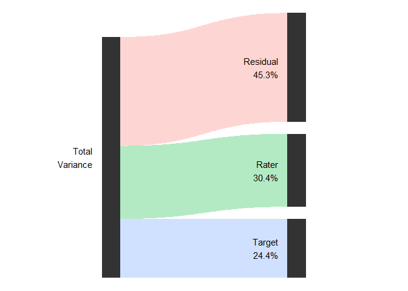
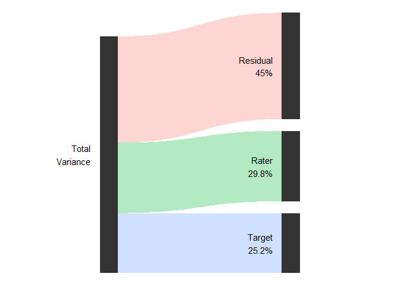
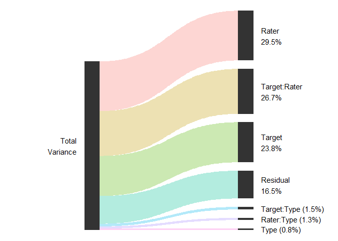

<!-- README.md is generated from README.Rmd. Please edit that file -->

# varde

<!-- badges: start -->
<!-- badges: end -->

The goal of varde is to provide functions for decomposing the variance
in multilevel models, e.g., for g studies in generalizability theory or
intraclass correlation analyses in interrater reliability.

## Installation

You can install the development version of varde from
[GitHub](https://github.com/) with:

``` r
# install.packages("devtools")
devtools::install_github("jmgirard/varde")
```

## Example

In the `ppa` example dataset, 72 human “raters” judged the perceived
physical attractiveness of 36 human “targets” in 6 different conditions
(i.e., stimulus “types”).

### Frequentist estimation using {lme4}

``` r
library(varde)
fit_1a <- lme4::lmer(
  formula = Score ~ 1 + (1 | Target) + (1 | Rater),
  data = ppa
)
res_1a <- varde(fit_1a, ci = 0.95)
res_1a
#> # A tibble: 3 × 6
#>   component variance lower upper percent method
#> * <chr>        <dbl> <dbl> <dbl>   <dbl> <chr> 
#> 1 Rater        1.04  0.755  1.46   0.304 lmer  
#> 2 Target       0.834 0.532  1.36   0.244 lmer  
#> 3 Residual     1.55  1.51   1.58   0.453 lmer
plot(res_1a)
```



### Bayesian estimation using {brms}

``` r
fit_1b <- brms::brm(
  formula = Score ~ 1 + (1 | Target) + (1 | Rater),
  data = ppa,
  chains = 4,
  cores = 4,
  init = "random",
  warmup = 5000,
  iter = 10000,
  refresh = 0,
  silent = 2,
  seed = 2022
)
res_1b <- varde(fit_1b, ci = 0.95)
res_1b
#> # A tibble: 3 × 6
#>   component variance lower upper percent method
#> * <chr>        <dbl> <dbl> <dbl>   <dbl> <chr> 
#> 1 Rater        1.03  0.768  1.51   0.298 brms  
#> 2 Target       0.869 0.561  1.46   0.252 brms  
#> 3 Residual     1.55  1.51   1.58   0.450 brms
plot(res_1b)
```



### More complicated example using {lme4}

``` r
fit_2 <- lme4::lmer(
  formula = Score ~ 1 + (1 | Target) + (1 | Rater) + (1 | Type) +
    (1 | Target:Rater) + (1 | Target:Type) + (1 | Rater:Type),
  data = ppa
)
res_2 <- varde(fit_2, ci = NULL)
res_2
#> # A tibble: 7 × 6
#>   component    variance lower upper percent method
#> * <chr>           <dbl> <dbl> <dbl>   <dbl> <chr> 
#> 1 Target:Rater   0.913     NA    NA 0.267   lmer  
#> 2 Rater:Type     0.0443    NA    NA 0.0129  lmer  
#> 3 Target:Type    0.0523    NA    NA 0.0153  lmer  
#> 4 Rater          1.01      NA    NA 0.295   lmer  
#> 5 Target         0.815     NA    NA 0.238   lmer  
#> 6 Type           0.0264    NA    NA 0.00772 lmer  
#> 7 Residual       0.564     NA    NA 0.165   lmer
plot(res_2)
```


