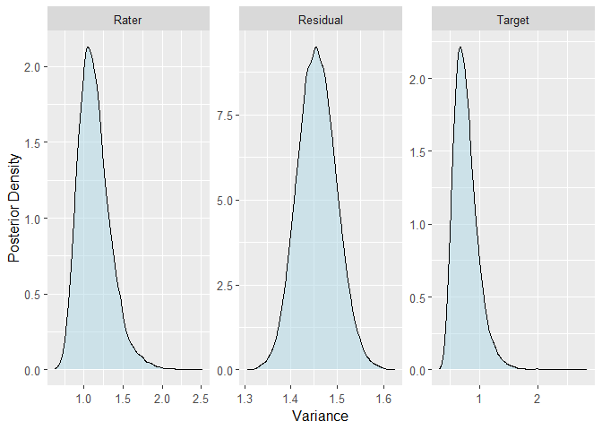
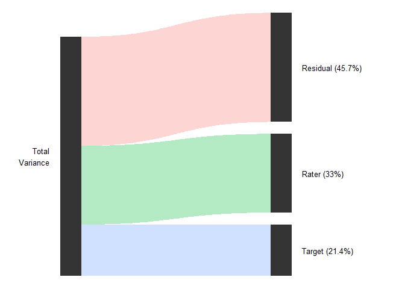

<!-- README.md is generated from README.Rmd. Please edit that file -->

# varde

<!-- badges: start -->
<!-- badges: end -->

The goal of varde is to provide functions for decomposing the variance
in multilevel models, e.g., for g studies in generalizability theory or
intraclass correlation analyses in interrater reliability.

## Installation

You can install the development version of varde from
[GitHub](https://github.com/) with:

``` r
# install.packages("devtools")
devtools::install_github("jmgirard/varde")
```

## Example

In the `ppa` example dataset, 72 human “raters” judged the perceived
physical attractiveness of 36 human “targets” in 6 different conditions
(i.e., stimulus “types”).

### Simple Generalizability Study

``` r
library(varde)

# Extract only type 1 observations (to simplify the example)
ppa_type1 <- ppa[ppa$Type == 1, ]

# Fit a mixed effects model with target and rater effects
fit_1 <- brms::brm(
  formula = Score ~ 1 + (1 | Target) + (1 | Rater),
  data = ppa_type1,
  chains = 4,
  cores = 4,
  init = "random",
  warmup = 5000,
  iter = 10000,
  seed = 2022
)

# Extract variance component estimates
res_1 <- varde(fit_1)
res_1
#> # A tibble: 3 × 6
#>   component variance lower upper percent method
#>   <chr>        <dbl> <dbl> <dbl>   <dbl> <chr> 
#> 1 Rater        1.05  0.811  1.63   0.330 brms  
#> 2 Target       0.681 0.471  1.26   0.214 brms  
#> 3 Residual     1.45  1.38   1.54   0.457 brms

# Create density plot of variance posteriors
plot(res_1, type = "posterior")
```



``` r

# Create river plot of variance percentages
plot(res_1, type = "river", font_size = 4)
```



### Simple Two-Way ICC for Inter-Rater Reliability

``` r
res_3 <- calc_icc(
  .data = ppa_type1, 
  subject = "Target",
  rater = "Rater",
  score = "Score"
)
res_3
#> # A tibble: 9 × 6
#>   term                icc lower upper raters error   
#>   <chr>             <dbl> <dbl> <dbl>  <dbl> <chr>   
#> 1 Subject Variance  0.710 0.482 1.28      NA <NA>    
#> 2 Rater Variance    1.07  0.811 1.62      NA <NA>    
#> 3 Residual Variance 1.45  1.38  1.54      NA <NA>    
#> 4 ICC(A,1)          0.219 0.154 0.336      1 Absolute
#> 5 ICC(A,k)          0.956 0.929 0.973     72 Absolute
#> 6 ICC(A,khat)       0.956 0.929 0.973     72 Absolute
#> 7 ICC(C,1)          0.330 0.248 0.470      1 Relative
#> 8 ICC(C,k)          0.975 0.960 0.985     72 Relative
#> 9 ICC(Q,khat)       0.975 0.960 0.985     72 Relative
```
