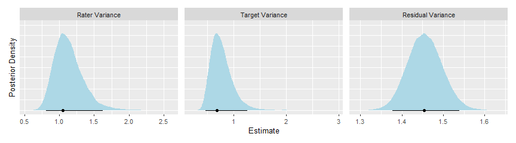

<!-- README.md is generated from README.Rmd. Please edit that file -->

# varde

<!-- badges: start -->
<!-- badges: end -->

The goal of varde is to provide functions for decomposing the variance
in multilevel models, e.g., for g studies in generalizability theory or
intraclass correlation analyses in interrater reliability.

## Installation

You can install the development version of varde from
[GitHub](https://github.com/) with:

``` r
# install.packages("devtools")
devtools::install_github("jmgirard/varde")
```

## Example

In the `ppa` example dataset, 72 human “raters” judged the perceived
physical attractiveness of 36 human “targets” in 6 different conditions
(i.e., stimulus “types”).

``` r
library(varde)

# Extract only type 1 observations (to simplify the example)
ppa_type1 <- ppa[ppa$Type == 1, ]
```

### Simple Generalizability Study

``` r
# Fit a mixed effects model with target and rater effects
fit_1 <- brms::brm(
  formula = Score ~ 1 + (1 | Target) + (1 | Rater),
  data = ppa_type1,
  chains = 4,
  cores = 4,
  init = "random",
  warmup = 5000,
  iter = 10000,
  seed = 2022,
  file = "m1"
)
```

``` r
# Extract variance component estimates
res_1 <- varde(fit_1)
res_1
#> # Variance Estimates
#> # A tibble: 3 × 6
#>   component term     estimate lower upper percent
#>   <chr>     <chr>       <dbl> <dbl> <dbl>   <dbl>
#> 1 Rater     Variance    1.05  0.811  1.63   0.330
#> 2 Target    Variance    0.680 0.471  1.26   0.214
#> 3 Residual  Variance    1.45  1.38   1.54   0.457
#> 
#> # Intercept Estimates
#> # A tibble: 108 × 6
#>    component    id term      estimate   lower  upper
#>    <chr>     <int> <chr>        <dbl>   <dbl>  <dbl>
#>  1 Rater         1 Intercept    0.883  0.454   1.35 
#>  2 Rater         2 Intercept    1.70   1.23    2.14 
#>  3 Rater         3 Intercept    0.568  0.101   1.02 
#>  4 Rater         4 Intercept   -1.19  -1.63   -0.725
#>  5 Rater         5 Intercept    0.487  0.0521  0.963
#>  6 Rater         6 Intercept    1.32   0.856   1.76 
#>  7 Rater         7 Intercept    0.288 -0.221   0.684
#>  8 Rater         8 Intercept   -0.143 -0.616   0.288
#>  9 Rater         9 Intercept   -0.695 -1.18   -0.280
#> 10 Rater        10 Intercept   -1.74  -2.23   -1.32 
#> # … with 98 more rows
```

``` r
# Create river plot of variance percentages
plot(res_1, type = "river")
```


``` r
# Create density plot of variance posteriors
plot(res_1, type = "variances")
```



``` r
# Create jitter plot of random intercepts
plot(res_1, type = "intercepts")
```


### Simple Two-Way ICC for Inter-Rater Reliability

``` r
# Calculate variance components and ICCs
res_2 <- calc_icc(
  .data = ppa_type1, 
  subject = "Target",
  rater = "Rater",
  scores = "Score",
  k = 12,
  file = "m2"
)
res_2
#> # ICC Estimates
#> # A tibble: 6 × 7
#>   score term        estimate lower upper raters error   
#>   <chr> <chr>          <dbl> <dbl> <dbl>  <dbl> <chr>   
#> 1 Score ICC(A,1)       0.220 0.154 0.337      1 Absolute
#> 2 Score ICC(A,k)       0.782 0.686 0.859     12 Absolute
#> 3 Score ICC(A,khat)    0.956 0.929 0.973     72 Absolute
#> 4 Score ICC(C,1)       0.336 0.246 0.470      1 Relative
#> 5 Score ICC(C,k)       0.862 0.797 0.914     12 Relative
#> 6 Score ICC(Q,khat)    0.974 0.959 0.985     72 Relative
#> 
#> # Variance Estimates
#> # A tibble: 3 × 6
#>   component term     estimate lower upper percent
#>   <chr>     <chr>       <dbl> <dbl> <dbl>   <dbl>
#> 1 Rater     Variance    1.07  0.800  1.58   0.332
#> 2 Target    Variance    0.703 0.480  1.28   0.218
#> 3 Residual  Variance    1.45  1.38   1.54   0.450
#> 
#> # Intercept Estimates
#> # A tibble: 108 × 6
#>    component    id term      estimate   lower  upper
#>    <chr>     <int> <chr>        <dbl>   <dbl>  <dbl>
#>  1 Rater         1 Intercept    0.875  0.442   1.37 
#>  2 Rater         2 Intercept    1.66   1.23    2.14 
#>  3 Rater         3 Intercept    0.579  0.108   1.02 
#>  4 Rater         4 Intercept   -1.17  -1.64   -0.731
#>  5 Rater         5 Intercept    0.522  0.0609  0.962
#>  6 Rater         6 Intercept    1.34   0.840   1.78 
#>  7 Rater         7 Intercept    0.248 -0.213   0.694
#>  8 Rater         8 Intercept   -0.190 -0.613   0.288
#>  9 Rater         9 Intercept   -0.684 -1.19   -0.264
#> 10 Rater        10 Intercept   -1.80  -2.23   -1.31 
#> # … with 98 more rows
```

``` r
# Create density plot of all posteriors
plot(res_2)
```


``` r
# Create density plot of specific posteriors
plot(res_2, parameters = c("ICC(A,k)", "ICC(C,k)"))
```

 \## Multivariate
MCMC for ICC

In `posneg`, 110 images were rated by between 2 and 5 raters on how
“Negative” and “Positive” they appeared.

``` r
# Calculate variance components and ICCs
res_3 <- calc_icc(
  .data = posneg, 
  subject = "Image",
  rater = "Rater",
  scores = c("Negative", "Positive"),
  file = "m3",
  control = list(adapt_delta = 0.999)
)
res_3
#> # ICC Estimates
#> # A tibble: 12 × 7
#>    score    term        estimate lower upper raters error   
#>    <chr>    <chr>          <dbl> <dbl> <dbl>  <dbl> <chr>   
#>  1 Negative ICC(A,1)       0.266 0.126 0.417   1    Absolute
#>  2 Negative ICC(A,khat)    0.470 0.234 0.602   2.12 Absolute
#>  3 Negative ICC(A,k)       0.684 0.419 0.781   5    Absolute
#>  4 Negative ICC(C,1)       0.270 0.132 0.423   1    Relative
#>  5 Negative ICC(Q,khat)    0.473 0.238 0.604   2.12 Relative
#>  6 Negative ICC(C,k)       0.691 0.433 0.785   5    Relative
#>  7 Positive ICC(A,1)       0.453 0.308 0.578   1    Absolute
#>  8 Positive ICC(A,khat)    0.640 0.485 0.743   2.12 Absolute
#>  9 Positive ICC(A,k)       0.809 0.690 0.872   5    Absolute
#> 10 Positive ICC(C,1)       0.461 0.316 0.583   1    Relative
#> 11 Positive ICC(Q,khat)    0.643 0.489 0.744   2.12 Relative
#> 12 Positive ICC(C,k)       0.814 0.698 0.875   5    Relative
#> 
#> # Variance Estimates
#> # A tibble: 6 × 7
#>   score    component term     estimate     lower upper  percent
#>   <chr>    <chr>     <chr>       <dbl>     <dbl> <dbl>    <dbl>
#> 1 Negative Image     Variance 2.61e- 1 0.128     0.478 2.72e- 1
#> 2 Negative Rater     Variance 2.98e-11 0.0000141 0.184 3.11e-11
#> 3 Negative Residual  Variance 6.96e- 1 0.578     0.918 7.28e- 1
#> 4 Positive Image     Variance 1.22e+ 0 0.797     1.89  4.51e- 1
#> 5 Positive Rater     Variance 1.59e-11 0.0000218 0.322 5.88e-12
#> 6 Positive Residual  Variance 1.48e+ 0 1.19      1.93  5.49e- 1
#> 
#> # Intercept Estimates
#> # A tibble: 230 × 7
#>    score    component    id term      estimate  lower upper
#>    <chr>    <chr>     <int> <chr>        <dbl>  <dbl> <dbl>
#>  1 Negative Image         1 Intercept  -0.396  -1.01  0.231
#>  2 Negative Image         2 Intercept  -0.0588 -0.729 0.493
#>  3 Negative Image         3 Intercept   0.0343 -0.605 0.633
#>  4 Negative Image         4 Intercept   1.03    0.373 1.74 
#>  5 Negative Image         5 Intercept  -0.374  -1.00  0.239
#>  6 Negative Image         6 Intercept  -0.226  -0.863 0.368
#>  7 Negative Image         7 Intercept  -0.121  -0.711 0.492
#>  8 Negative Image         8 Intercept   1.24    0.457 1.87 
#>  9 Negative Image         9 Intercept  -0.368  -0.978 0.226
#> 10 Negative Image        10 Intercept  -0.363  -0.999 0.239
#> # … with 220 more rows
```
