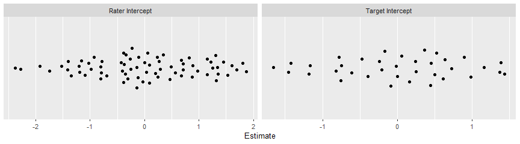
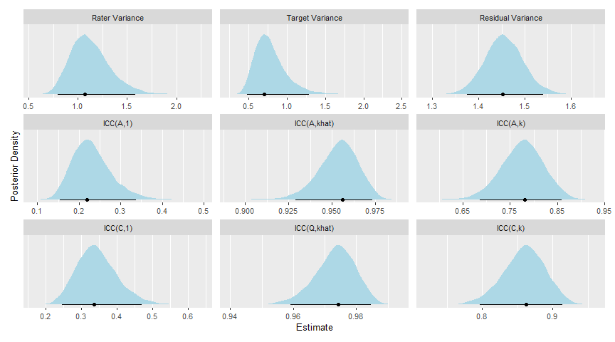
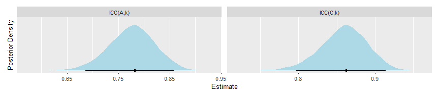

<!-- README.md is generated from README.Rmd. Please edit that file -->

# varde

<!-- badges: start -->
<!-- badges: end -->

The goal of varde is to provide functions for decomposing the variance
in multilevel models, e.g., for g studies in generalizability theory or
intraclass correlation analyses in interrater reliability.

## Installation

You can install the development version of varde from
[GitHub](https://github.com/) with:

``` r
# install.packages("devtools")
devtools::install_github("jmgirard/varde")
```

## Example

In the `ppa` example dataset, 72 human “raters” judged the perceived
physical attractiveness of 36 human “targets” in 6 different conditions
(i.e., stimulus “types”).

``` r
library(varde)

# Extract only type 1 observations (to simplify the example)
ppa_type1 <- ppa[ppa$Type == 1, ]
```

### Simple Generalizability Study

``` r
# Fit a mixed effects model with target and rater effects
fit_1 <- brms::brm(
  formula = Score ~ 1 + (1 | Target) + (1 | Rater),
  data = ppa_type1,
  chains = 4,
  cores = 4,
  init = "random",
  warmup = 5000,
  iter = 10000,
  seed = 2022,
  file = "m1"
)
```

``` r
# Extract variance component estimates
res_1 <- varde(fit_1)
res_1
#> # Variance Estimates
#> # A tibble: 3 × 6
#>   component term     estimate lower upper percent
#>   <chr>     <chr>       <dbl> <dbl> <dbl>   <dbl>
#> 1 Rater     Variance    1.05  0.811  1.63   0.330
#> 2 Target    Variance    0.679 0.471  1.26   0.213
#> 3 Residual  Variance    1.45  1.38   1.54   0.457
#> 
#> # Intercept Estimates
#> # A tibble: 108 × 6
#>    component id    term      estimate   lower  upper
#>    <chr>     <chr> <chr>        <dbl>   <dbl>  <dbl>
#>  1 Rater     1     Intercept    0.884  0.454   1.35 
#>  2 Rater     2     Intercept    1.69   1.23    2.14 
#>  3 Rater     3     Intercept    0.569  0.101   1.02 
#>  4 Rater     4     Intercept   -1.19  -1.63   -0.725
#>  5 Rater     5     Intercept    0.495  0.0521  0.963
#>  6 Rater     6     Intercept    1.32   0.856   1.76 
#>  7 Rater     7     Intercept    0.276 -0.221   0.684
#>  8 Rater     8     Intercept   -0.142 -0.616   0.288
#>  9 Rater     9     Intercept   -0.705 -1.18   -0.280
#> 10 Rater     10    Intercept   -1.75  -2.23   -1.32 
#> # … with 98 more rows
```

``` r
# Create river plot of variance percentages
plot(res_1, type = "river")
```

<!-- -->

``` r
# Create density plot of variance posteriors
plot(res_1, type = "variances")
```

<!-- -->

``` r
# Create jitter plot of random intercepts
plot(res_1, type = "intercepts")
```

<!-- -->

### Simple Two-Way ICC for Inter-Rater Reliability

``` r
# Calculate variance components and ICCs
res_2 <- calc_icc(
  .data = ppa_type1, 
  subject = "Target",
  rater = "Rater",
  score = "Score",
  file = "m2"
)
res_2
#> # ICC Estimates
#> # A tibble: 6 × 6
#>   term          est lower upper raters error   
#>   <chr>       <dbl> <dbl> <dbl>  <dbl> <chr>   
#> 1 ICC(A,1)    0.329 0.252 0.423      1 Absolute
#> 2 ICC(A,k)    0.973 0.960 0.981     72 Absolute
#> 3 ICC(A,khat) 0.973 0.960 0.981     72 Absolute
#> 4 ICC(C,1)    0.435 0.350 0.521      1 Relative
#> 5 ICC(C,k)    0.983 0.975 0.987     72 Relative
#> 6 ICC(Q,khat) 0.983 0.975 0.987     72 Relative
#> 
#> # Variance Estimates
#> # A tibble: 3 × 6
#>   component term     estimate lower upper percent
#>   <chr>     <chr>       <dbl> <dbl> <dbl>   <dbl>
#> 1 Subject   Variance    1.04  0.786  1.57   0.326
#> 2 Rater     Variance    0.694 0.469  1.26   0.217
#> 3 Residual  Variance    1.46  1.38   1.54   0.457
#> 
#> # Intercept Estimates
#> # A tibble: 108 × 6
#>    component id    term      estimate   lower  upper
#>    <chr>     <chr> <chr>        <dbl>   <dbl>  <dbl>
#>  1 Rater     1     Intercept    0.885  0.463   1.35 
#>  2 Rater     2     Intercept    1.72   1.24    2.12 
#>  3 Rater     3     Intercept    0.573  0.109   1.01 
#>  4 Rater     4     Intercept   -1.19  -1.64   -0.737
#>  5 Rater     5     Intercept    0.497  0.0437  0.953
#>  6 Rater     6     Intercept    1.32   0.864   1.75 
#>  7 Rater     7     Intercept    0.239 -0.216   0.677
#>  8 Rater     8     Intercept   -0.149 -0.626   0.289
#>  9 Rater     9     Intercept   -0.716 -1.18   -0.276
#> 10 Rater     10    Intercept   -1.76  -2.22   -1.34 
#> # … with 98 more rows
```

``` r
# Create density plot of all posteriors
plot(res_2)
```

<!-- -->

``` r
# Create density plot of specific posteriors
plot(res_2, parameters = c("ICC(A,k)", "ICC(C,k)"))
```

<!-- -->
